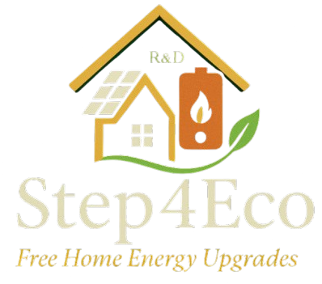

# Step4Eco



Step4Eco is a responsive and user-friendly website for a company that provides eco-friendly solutions for homes. The website is built with React and Tailwind CSS, and it showcases the company's services, allows users to check their eligibility for free products, and provides a contact form for inquiries.

## About The Project

This project is a modern, single-page application designed to be the online presence for Step4Eco. It details the company's offerings, which include solar panel installation, roof and wall insulation, and heat pump systems. The primary goal of the website is to inform potential customers about the benefits of eco-friendly home solutions and to generate leads through an eligibility checker and contact form.

### Built With

*   [React](https://reactjs.org/)
*   [Vite](https://vitejs.dev/)
*   [Tailwind CSS](https://tailwindcss.com/)
*   [React Router](https://reactrouter.com/)
*   [Framer Motion](https://www.framer.com/motion/)
*   [EmailJS](https://www.emailjs.com/)

## Features

*   **Services Overview:** A detailed look at the services offered, including benefits and descriptions.
*   **Eligibility Checker:** An interactive form to determine if a user is eligible for a free shower head, helping to generate leads.
*   **Contact Form:** A simple and effective way for users to get in touch with the company.
*   **Responsive Design:** The website is fully responsive and works on all devices, from mobile phones to desktop computers.
*   **Smooth Animations:** Subtle animations using Framer Motion to enhance the user experience.

## Getting Started

To get a local copy up and running follow these simple example steps.

### Prerequisites

You need to have Node.js and npm installed on your machine.
* npm
  ```sh
  npm install npm@latest -g
  ```

### Installation

1. Clone the repo
   ```sh
   git clone https://github.com/your_username_/Project-Name.git
   ```
2. Install NPM packages
   ```sh
   npm install
   ```
3. Start the development server
   ```sh
    npm run dev
   ```
4. Open your browser and navigate to `http://localhost:5173/`

## Usage

The website is designed to be intuitive and easy to navigate. Users can scroll through the homepage to learn about the company and its services. The navigation bar provides links to different sections of the page, including the services overview, eligibility checker, and contact form.

The eligibility checker is a simple form that users can fill out to see if they qualify for a free shower head. The contact form allows users to send a message directly to the company's email address.

## Contact

Your Name - [@your_twitter](https://twitter.com/your_twitter) - email@example.com

Project Link: [https://github.com/your_username_/Project-Name](https://github.com/your_username_/Project-Name)

## Acknowledgements

*   [React Icons](https://react-icons.github.io/react-icons/)
*   [Lucide React](https://lucide.dev/guide/packages/lucide-react)
*   [Google Fonts](https://fonts.google.com/)
